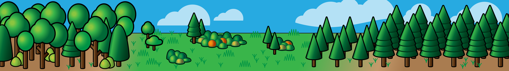

<!-- -----------------------------------------------------------------------------------------------
https://github.com/JoshuaRady/JoshuaRady    README.md
JMR
Started: 9/7/2020

Special repository ReadMe renders to the top of the account profile page.

Copyright (C) 2020 Joshua M. Rady (Curator) All Rights Reserved
------------------------------------------------------------------------------------------------ -->

<!-- The ReadMe section of the profile is about 904 px. -->

Hello, I'm a graduate student studying under Professor [Quinn Thomas](https://www.epics.frec.vt.edu/?page_id=67) in the [Department of Forest Resources and Environmental Conservation](http://frec.vt.edu) at [Virginia Tech](https://vt.edu).

The earth's forests are central to it's climate. In my reasearch I use Earth System Models, computer models that simulate the planet, to explore the role that human managment of forests has on our climate.  How are the forest [ecosystem services](https://en.wikipedia.org/wiki/Ecosystem_service) we depend on going to be affected by climate change? Can we manage forests in way that will help mitigate climate change?

I use the Community Land Model, an instatiation of the Community Terrestrial Systems Model, which is part of the Community Earth System Model (CESM)...

**My current projects in the FATES model include:**
* Developing a loblolly pine plant functional type.
* Incorporating forest managment activies not present in the existing logging module.
